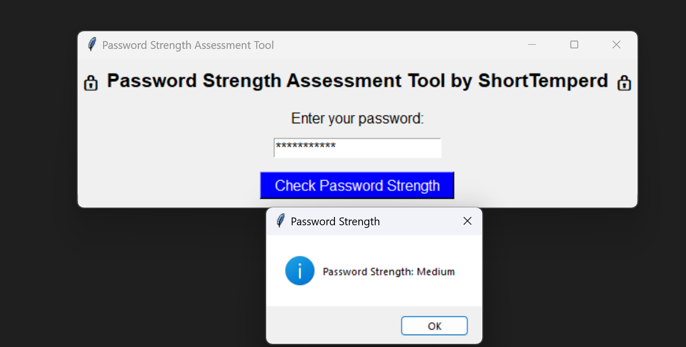

# PRODIGY_CS_03
a simple python code for Checking the password strength

This code is written is to check the strength of your enterd password whether your password is week medium or strong.

Some output results of the code are shared below

Having any question feel free to contact me!!

Linkedin    https://www.linkedin.com/in/muhammad-huzaifa-anjum-a80aa0279/

instagram  https://www.instagram.com/shorttemperd007/

